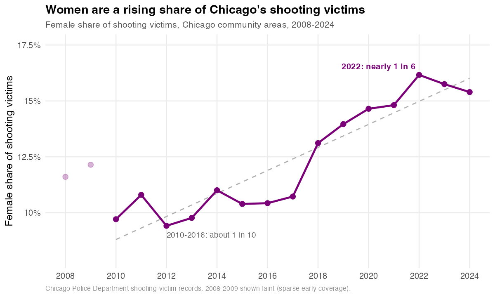

# Chicago gang territory, gun violence, and violence against women

**Data and R code for "Criminal Order and Gendered Violence: Gang Control, State
Repression, and Violence Against Women in Chicago" (Lins 2026).**

Women are a rising share of the people shot in Chicago. Between 2010 and 2016
they were about one in ten of the city's shooting victims. By 2022 the share had
reached nearly one in six, and it has not fallen since. This repository holds the
data and code behind that finding and the analysis around it.



Across Chicago's 77 community areas, what predicts violence against women is not
which gang holds a neighborhood. Folk Nation and People Nation territories record
nearly identical female-victimization rates. What predicts it is whether a stable
territorial order exists at all. Where one gang consolidates control, reported
domestic violence falls. Where many compete, it rises. A difference-in-differences
design around the 2015 Laquan McDonald rupture shows female shooting victims
climbing by about half, and fatal shootings of women nearly doubling, in the
most heavily armed areas relative to the least.

The panel covers community area × year, 2008–2024, and links gang-territory
coverage, shooting victims, domestic-violence incidents, homicides, and Census
demographics. Every input is public, and everything is in R.

The package has two layers. The **analysis** runs offline from the intermediate
files shipped here, with no downloads. The **build** (`scripts/build/`)
reconstructs those files from the raw Chicago open-data downloads, including the
gang-territory spatial join that defines the treatment. Running the build on the
frozen raw data reproduces the shipped intermediates, and the analysis on either
reaches the same `32 OK` consistency check.

> **Cite this:** see [`CITATION.cff`](CITATION.cff) or the "Cite this repository"
> button above. Please cite both the paper and this repository.

---

## Layout

```
.
├── scripts/
│   ├── 00_setup.R                       install the R packages
│   ├── 47_painel_chicago_consolidado.R  build the community-area × year panel
│   ├── 48_regressoes_chicago.R          cross-sectional OLS, balance table, Moran's I
│   ├── 49_event_study_chicago.R         event study and difference-in-differences
│   ├── 50_robustez_matching_chicago.R   entropy-balanced DiD
│   ├── 55_mechanism_tests_chicago.R     post-2015 DiD breakdowns; gang-change event study
│   ├── 56_consistency_check.R           recomputes key statistics and checks them
│   └── build/                           raw → intermediate (download, consolidate, spatial join)
├── data/
│   ├── processed/                       analysis-ready panel and ACS controls
│   ├── intermediate/                    incident-level DV, gang-matched shootings
│   └── raw_boundaries/                  community-area polygons
├── results/                             tables produced by the scripts (regenerated each run)
├── data_dictionary.md                   column-by-column description of every file
├── RAW_DATA.md                          raw sources, identifiers, access date, SHA-256 freeze
├── ENVIRONMENT.md                       R and package versions
├── AI_USE.md                            statement on AI-tool use
├── LICENSE
└── README.md
```

---

## Requirements

R ≥ 4.3. Install the packages once:

```bash
Rscript scripts/00_setup.R
```

Packages used: dplyr, tidyr, readr, stringr, fixest, sandwich, lmtest, broom,
sf, spdep, spatialreg, WeightIt, cobalt, ggplot2, scales.

---

## Running

Run from the repository root, in order. The scripts resolve their own location,
so the working directory does not matter.

```bash
Rscript scripts/47_painel_chicago_consolidado.R     # builds data/processed/chicago_painel_completo.csv
Rscript scripts/48_regressoes_chicago.R             # ~1 min (9,999-rep wild bootstrap)
Rscript scripts/49_event_study_chicago.R
Rscript scripts/50_robustez_matching_chicago.R
Rscript scripts/55_mechanism_tests_chicago.R
Rscript scripts/56_consistency_check.R              # recomputes & checks key statistics
```

Script 47 builds the panel that 48, 49, 50, and 55 all read. Script 56 reads
outputs from 48 and 50, so it runs last. It recomputes a set of headline
statistics from the data, compares each to its reference value within a
tolerance, writes `results/consistency_check.csv`, and exits non-zero if any
item fails — so it can also serve as a CI / pre-release gate.

---

## Rebuilding the intermediate data from raw

The analysis above needs nothing but this repository. To rebuild the
intermediate files from the raw Chicago downloads instead, including the
gang-territory spatial join that defines the treatment, use `scripts/build/`.
This is the full provenance, in R.

```bash
# 1. get the frozen raw data (see RAW_DATA.md), verify checksums, stage under data/raw/chicago/
# 2. then:
Rscript scripts/build/07_consolidate_chicago.R     # raw crimes/shootings -> 2008–2024 tables
Rscript scripts/build/11_gang_spatial_join.R       # gang panel + point-in-polygon + aggregation
# (scripts/build/03_download_chicago.R fetches the raw from the live portal, for provenance)
```

Running `07` then `11` on the frozen raw reproduces the shipped intermediates:
domestic-violence 855,387 records, shooting victims 49,291, homicides 9,882, and
a treatment assignment (the pre-2015 gang-coverage tertiles) identical to the
one shipped. The analysis then reaches the same `32 OK`. See
`scripts/build/README.md` for the method (CRS, predicate, missing-year handling)
and `RAW_DATA.md` for the sources, identifiers, and checksums.

The Chicago Data Portal is a live system, so re-downloading with `03` will not
reproduce the frozen counts. That is why the raw data is frozen and checksummed
rather than re-fetched.

---

## Data sources (all public)

| Series | Source | Identifier | Records | Coverage |
|---|---|---|---|---|
| Domestic-violence incidents | City of Chicago, "Crimes 2001 to Present" (domestic flag) | `ijzp-q8t2` | 855,387 | 2008–2024 |
| Homicides | Same crimes dataset, homicide offense | `ijzp-q8t2` | 9,882 | 2008–2024 |
| Shooting victims | "Violence Reduction — Victims of Homicides and Non-Fatal Shootings" | `gumc-mgzr` | 49,291 | 2008–2024 |
| Gang-territory polygons | Chicago Police Department CLEARMAP gang-territory maps (GIS portal) | — | annual maps | 2007–2024 (2011, 2013 absent) |
| Demographics | U.S. Census Bureau, American Community Survey (5-year) | — | — | 5-year estimates |

Identifiers refer to the [Chicago Data Portal](https://data.cityofchicago.org).
The incident-level domestic-violence file shipped here keeps the six fields the
scripts use (`community_area`, `date`, `location_description`, `primary_type`,
`arrest`, `year`); the full 22-field export is recoverable from the portal under
the identifier above.

The analysis operates at the community-area × year level, never at the
individual record. The shipped shooting-victim file is reduced to the columns
the analysis actually reads, plus coarse administrative units. I removed the
victim's name, the exact latitude and longitude, the address block, the case
and record numbers, the ZIP, the minute-resolution timestamp, and the victim's
age and race — everything that identifies a victim or narrows the record beyond
its community area. The published Chicago data carry those fields; I drop them
here because the pipeline uses none of them and a precise record of a lethal
shooting is a re-identification surface. What remains is the community area (the
join key), the coarse administrative units (ward, area, district, beat), the
calendar year, the victim's sex, the place type, the offense, and the joined
gang territory — each as published by the City of Chicago.

See `data_dictionary.md` for a column-by-column description of every file.

---

## Construction notes

- The temporal unit is the calendar year; the spatial unit is the Chicago
  community area (77 areas).
- **2015 is dropped from the analyses.** Its public crimes extract holds 7,507
  domestic-violence records against a period median near 51,000, consistent with
  an incomplete export. `results/diagnostico_n_por_ano_chicago.csv` documents the
  per-year counts.
- Annual gang coverage is highly stable across years (within-area inter-year
  correlation above 0.97), and two map years are missing, so each community area
  is assigned its **modal dominant gang** across all mapped years. The 2011 and
  2013 gaps use a nearest-year fallback, flagged in the panel.
- The DV **arrest rate** is administrative: the share of domestic-violence
  incidents recorded as resulting in an arrest. The CPD arrests dataset
  (`dpt3-jri9`) begins in 2014, so arrest counts before 2014 are zero.

---

## On the use of AI tools

A statement on the use of AI tools in building this package is in `AI_USE.md`.

## License

Code: MIT (see `LICENSE`). Data files are redistributed from the public sources
listed above and remain subject to their providers' terms.
